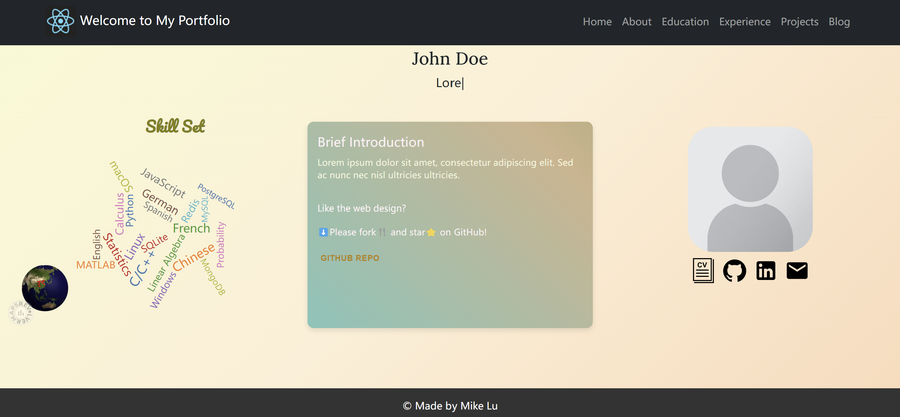

# React Personal Portfolio Template

[Demo](https://mikelovesolivia.github.io/react-personal-portfolio-template/)

A dynamic personal portfolio template built with React.
It provides an easy-to-use platform for developers, researchers and students to showcase their work visually.




## Layout

- Home 🏠
  - Visitor Globe 🌏
  - Skill Set Word Cloud ☁️
  - Brief Introduction
  - Personal Image 🙋
  - Social Media and Contact 📧
- About ℹ️
  - About Description
  - Skills
    - Skill List
    - Skill Icon Cloud ☁️
  - Research
    - Research Interests
    - Publication (optional) 📖
  - Interests
    - Interest Word Tree 🌴
- Education 🏫
- Experience 🏢
- Projects 🏗️
- Blog (from external link) 📓

## Getting started

You need to have `Node.js` installed beforehand.

First, clone the repository by

```
git clone https://github.com/mikelovesolivia/react-personal-portfolio-template.git
```

Then go to the project folder and install the required JavaScript packages by

`npm install`

Finally, you can start the project by running

`npm start`

And you will see it run on [http://localhost:3000](http://localhost:3000/).

## Folder structure

- `./public` stores publicly accessible contents (images, videos, etc.). 
- `./src` stores the source code of the project.
  - `./src/pages` stores all pages `(.jsx)` and the corresponding style sheet `styles.css`.
  - `./src/components` stores all components `(.jsx)` used for the pages and the corresponding style sheet `components.css`.
  - `./src/data` stores all data for the project. Each data file `(.js)` corresponds to a page with the related name.


## Customize

- Prepare your data 
  - If you want to add new files and show them on your customized dataset, you can just store them in the `./public` folder. When you need to provide the address for that file, you only need to provide the path relative to `./public`.
  - For example, as to an image stored in `./public/images/image.png`, you only need to refer it as `./images/image.png` as its path.

- Customize your content
  - Modify the data files `(.js)` following the example code and comment instructions.

- Make your blog
  - If you do not want a blog, you can remove line 59 ~ 65 to disable the blog section:
  ```jsx
  <Nav.Link 
    href="https://mikelovesolivia.github.io/react-personal-portfolio-template/"
    target="_blank"
    rel="noopener noreferrer"
  >
    Blog
  </Nav.Link>
  ```
  - If you have your own blog already, just change the link above to yours.
  - If you do not have a blog but want to have one, you can build it with [Hexo](https://hexo.io/). You can follow this [tutorial](https://hexo.io/docs/).

## Deploy on GitHub Pages

Deployment is done following this [Doc](https://github.com/gitname/react-gh-pages):
- Go to `package.json` and change the URL of `"homepage"` in line 5
  ```"homepage": "https://mikelovesolivia.github.io/react-personal-portfolio-template/"```
  into your GitHub address `https://<your_github_username>.github.io/<your_repo_name>/`
- Install the `gh-pages` package 
  ```npm install gh-pages --save-dev```
- Initialize `git`
  ```git init```
- Add a remote GitHub repo to the local Git repo
  ```git remote add origin https://github.com/{your_github_username}/{your_repo_name}.git```
- Finally you can deploy by
  ```npm run deploy``` and you will see it in your `gh-pages` branch.
- If you haven't made a GitHub Page for your repo, go to `Settings/Pages/` and change the `branch` under `Build and deployment` from `main` (or other branches) to `gh-pages`. You will see the change in few minutes.
  
## Technologies used

- Languages: HTML, CSS, JavaScript
- Frontend: React
- Deploy: Github Pages
- Styling: Bootstrap, MUI
